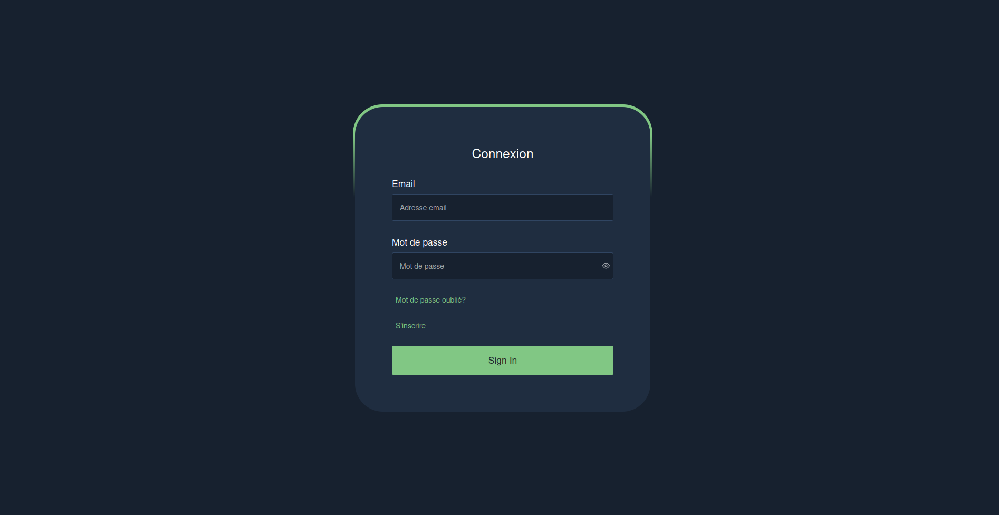
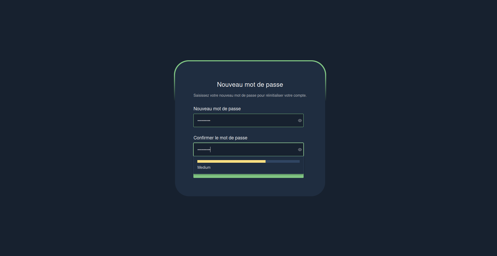
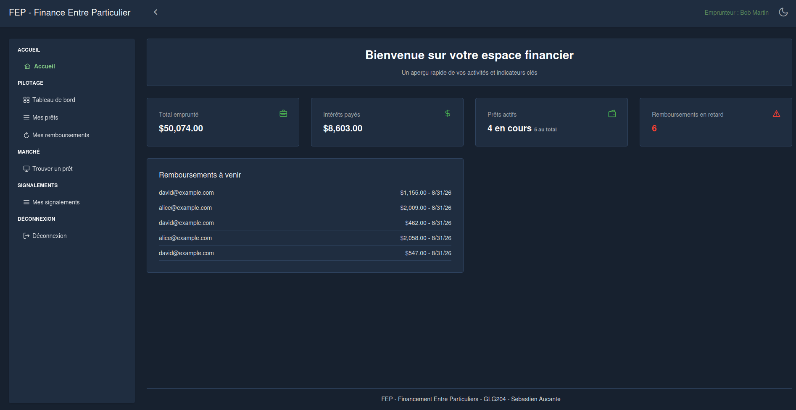
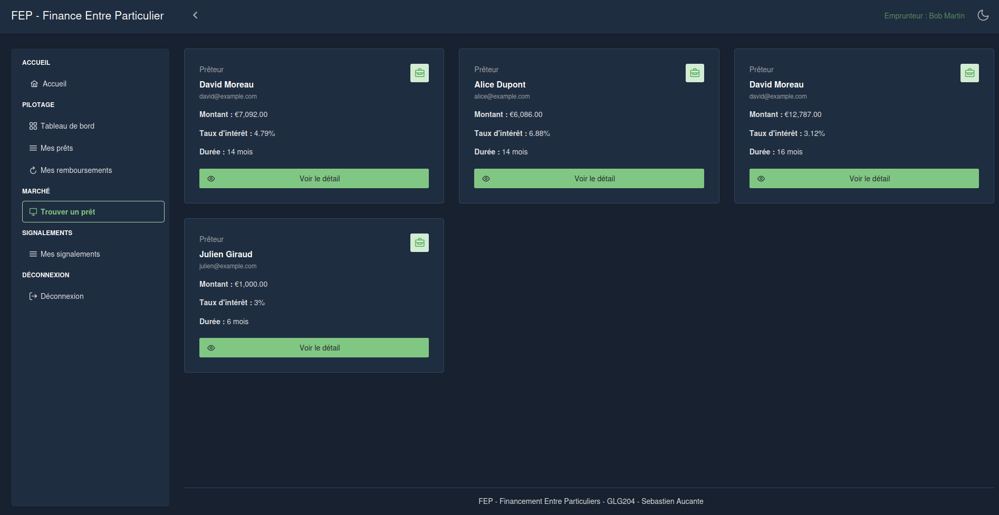
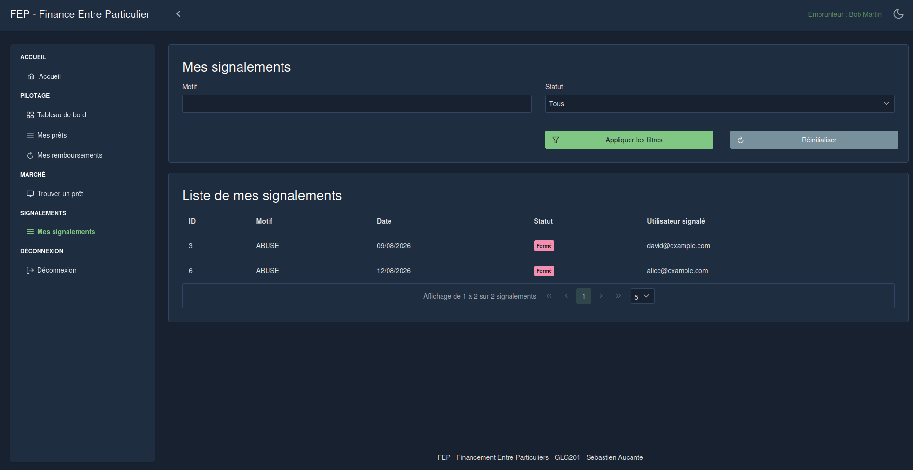

# Backend – FEP: Financement entre particuliers
---

## Tools
- **JAVA 17** (`--no-standalone`)
- **Spring Boot 3**

## For launch dev environment quickly, make step 3 (cp .env.exmeple .env)

---

## Docker

1.**Run all project (without changes)**
```bash
docker-compose -f docker-compose.prod.yml up -d
```

2.**Relaunch prod (with latest changes)**
```bash
docker compose -f docker-compose.prod.yml down -v 
./gradlew clean bootJar
docker compose -f docker-compose.prod.yml up --build -d           
```

3.**Launch dev**
```bash
docker compose -f docker-compose.dev.yml up --build -d          
```

4.**Launch tests**
```bash
./gradlew test     
```

4.**Launch Project**
```bash
./gradlew bootRun
```

<p align="center">
  
  
</p>
<p align="center">
  
  </p>
<p align="center">
  
  
</p>